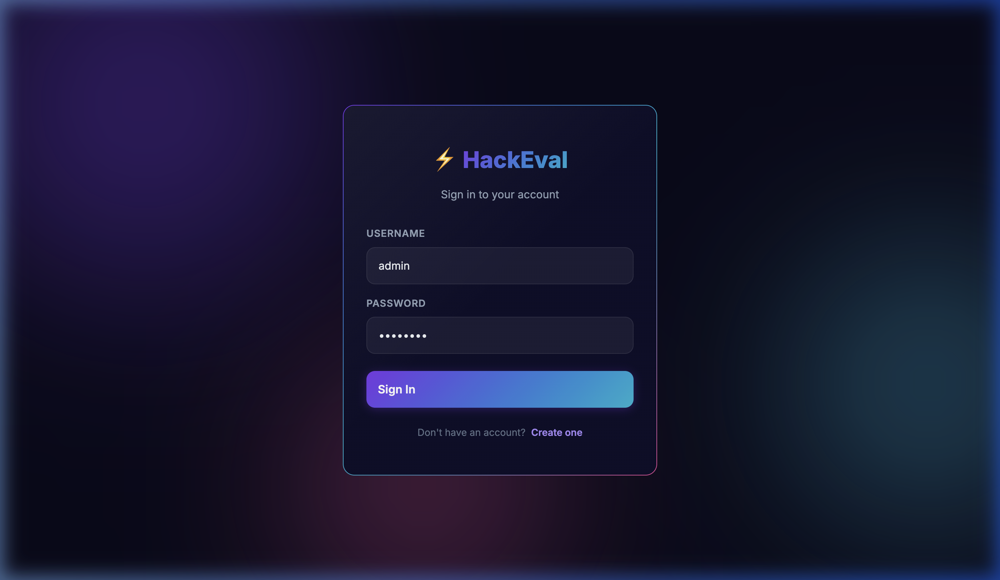
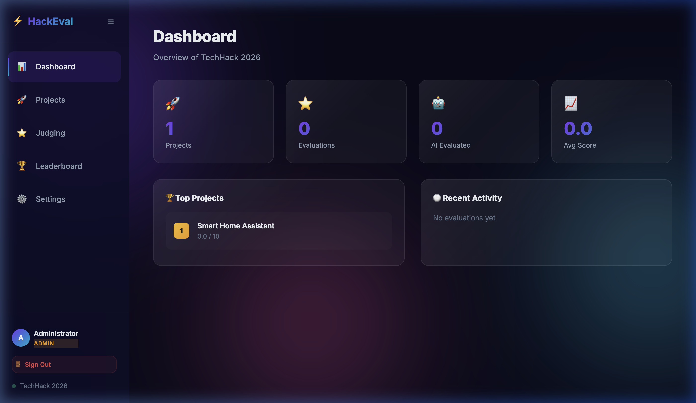
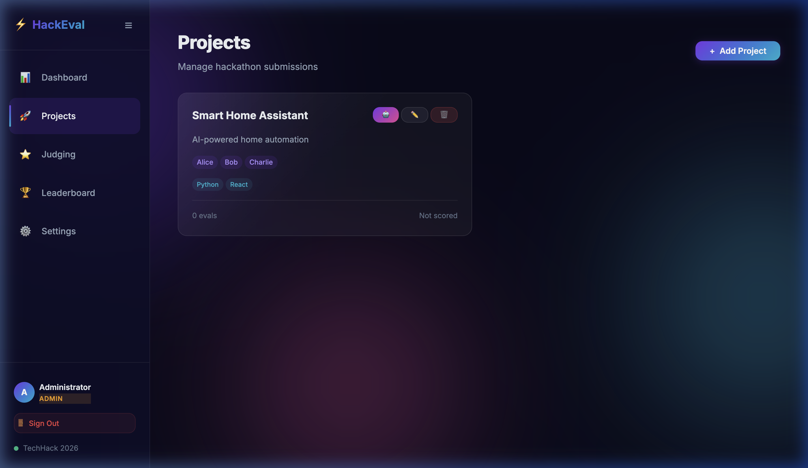
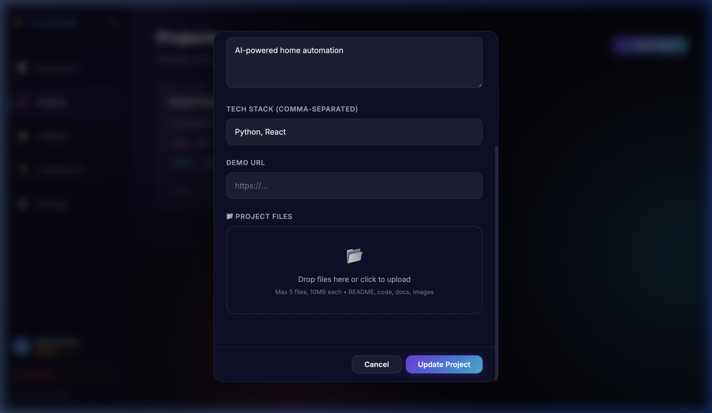
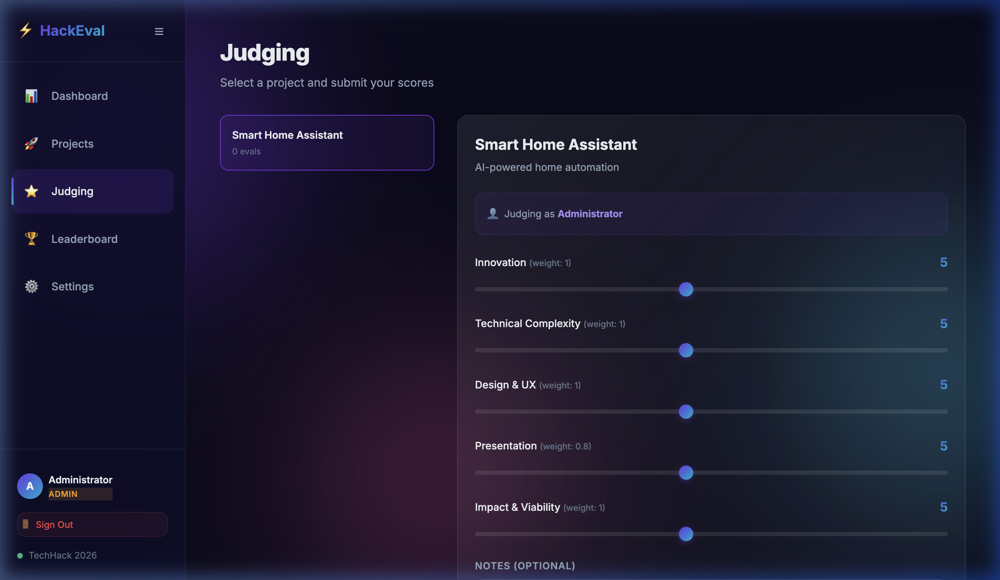
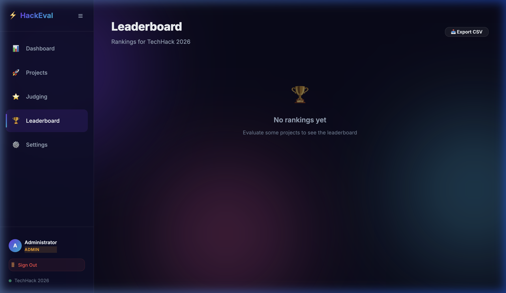
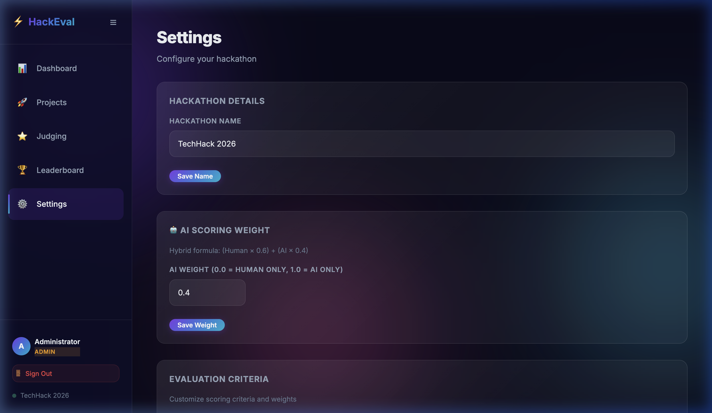
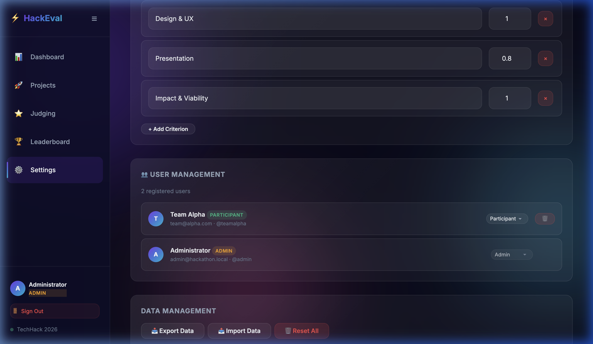
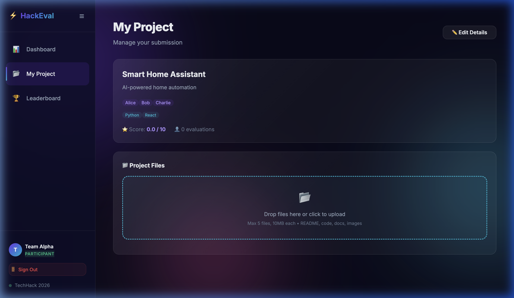

# ⚡ HackEval — Hackathon Evaluator

A **full-stack hackathon project evaluator** with human judging, AI-powered scoring via AWS Bedrock, and a hybrid leaderboard that blends both.

Built with **Node.js**, **SQLite**, and a **glassmorphism dark-mode SPA**.

---

## ✨ Features

| Feature | Description |
|---|---|
| 🔐 **3-Role Auth** | Admin, Judge, Participant — JWT-based with bcrypt |
| 📂 **File Uploads** | Participants upload code, README, PPT, PDF via drag-and-drop |
| 🤖 **AI Evaluation** | AWS Bedrock Claude Sonnet 4.5 (`us.anthropic.claude-sonnet-4-5-20250514-v1:0`) scores projects automatically |
| ⭐ **Human Judging** | Judges rate projects on configurable criteria (1–10 sliders) |
| 📊 **Hybrid Leaderboard** | Blends human + AI scores with configurable weight |
| ⚙️ **Admin Settings** | Hackathon name, evaluation criteria, AI weight, user management |

---

## 🖼️ Screenshots

### Login


### Admin Dashboard


### Projects Management


### Project Edit — File Upload Dropzone


### Judging Interface


### Leaderboard (Hybrid Scoring)


### Settings — AI Scoring Weight


### Admin — User Management


### Participant View — My Project


---

## 🔄 How It Works

```
┌──────────────┐     ┌──────────────┐     ┌──────────────┐
│  PARTICIPANT │     │    JUDGE     │     │    ADMIN     │
│  registers   │     │   logs in    │     │   logs in    │
└──────┬───────┘     └──────┬───────┘     └──────┬───────┘
       │                    │                    │
       ▼                    │                    │
  Create Project            │              Manage Settings
  Upload Files              │              Configure Criteria
  (code, PPT, PDF)         │              Set AI Weight
       │                    │                    │
       │                    ▼                    ▼
       │              Judge Projects       Trigger 🤖 AI
       │              (1–10 sliders)       Evaluation
       │                    │                    │
       │                    ▼                    ▼
       │              Human Scores         AI Scores
       │                    │              (via Bedrock)
       │                    │                    │
       │                    └────────┬───────────┘
       │                             ▼
       │                    ┌────────────────┐
       └──────────────────▶ │  LEADERBOARD   │
                            │ Hybrid Score = │
                            │ Human×0.6 +   │
                            │ AI×0.4        │
                            └────────────────┘
```

### Step-by-Step Process

1. **Participant registers** → automatically gets the `participant` role
2. **Creates a project** on the "My Project" page (name, team, description, tech stack)
3. **Uploads files** — code, README, PPT, PDF, images (max 5 files, 10MB each)
4. **Admin triggers AI evaluation** 🤖 → sends files to AWS Bedrock Claude Sonnet 4.5 → returns per-criterion scores + reasoning
5. **Human judges evaluate** → rate projects on criteria like Innovation, Technical Complexity, Design & UX, etc.
6. **Leaderboard auto-computes** hybrid scores: `(Human × 0.6) + (AI × 0.4)` (weight configurable)

---

## 👥 Roles & Permissions

| Action | Admin | Judge | Participant |
|---|:---:|:---:|:---:|
| Create/edit projects | ✅ All | ❌ | Own only |
| Upload files | ✅ All | ❌ | Own project |
| Trigger AI evaluation | ✅ | ❌ | ❌ |
| Judge projects | ✅ | ✅ | ❌ |
| View leaderboard | ✅ | ✅ | ✅ |
| Manage settings/users | ✅ | ❌ | ❌ |

---

## 🚀 Quick Start

### Prerequisites
- **Node.js** 18+
- **AWS credentials** configured (`~/.aws/credentials`) — for AI evaluation
- **Claude Sonnet 4.5** (`us.anthropic.claude-sonnet-4-5-20250514-v1:0`) enabled in AWS Bedrock console

### Install & Run

```bash
# Clone the repo
git clone <repo-url>
cd hackthon-evaluator

# Install dependencies
npm install

# Start the server
npm start
```

Open **http://localhost:3000** in your browser.

### Default Admin Account
- **Username:** `admin`
- **Password:** `admin123`

### Environment Variables (Optional)

| Variable | Default | Description |
|---|---|---|
| `PORT` | `3000` | Server port |
| `JWT_SECRET` | `hackathon-secret-...` | JWT signing key (change in production) |
| `AWS_REGION` | `us-east-1` | AWS region for Bedrock |

---

## 🗂️ Project Structure

```
hackthon-evaluator/
├── server.js              # Express backend (API, auth, DB, Bedrock)
├── package.json
├── public/
│   ├── index.html         # SPA shell
│   ├── app.js             # Frontend logic (router, components, API)
│   └── styles.css         # Glassmorphism dark theme
├── uploads/               # Uploaded project files (auto-created)
├── docs/
│   └── screenshots/       # App screenshots
└── hackathon.db           # SQLite database (auto-created)
```

---

## 🏗️ Tech Stack

| Layer | Technology |
|---|---|
| **Backend** | Node.js, Express |
| **Database** | SQLite (better-sqlite3) |
| **Auth** | JWT + bcrypt |
| **File Upload** | Multer |
| **AI Evaluation** | AWS Bedrock (Claude Sonnet 4.5) |
| **Frontend** | Vanilla JS SPA |
| **Styling** | CSS with glassmorphism, gradients, micro-animations |

---

## 📊 Hybrid Scoring Formula

```
Final Score = (Human Average × (1 - AI_WEIGHT)) + (AI Score × AI_WEIGHT)
```

- **Default AI Weight:** `0.4` (40% AI, 60% human)
- Configurable in **Settings → AI Scoring Weight** (0.0 = human only, 1.0 = AI only)
- If only human or only AI scores exist, the available score is used at full weight

---

## 📝 License

MIT
